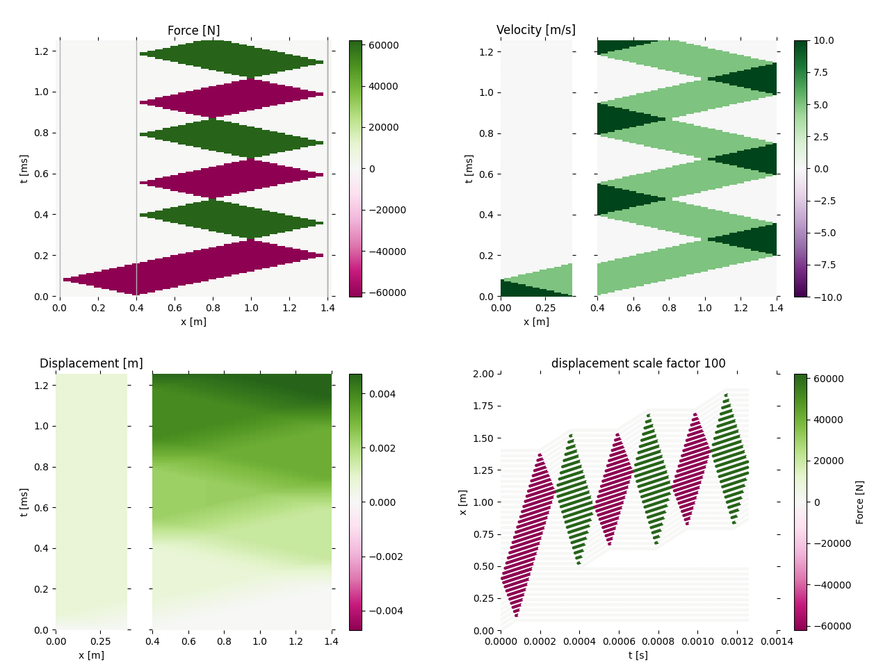

# Summary

`elwaspatid` is a Python package for 1D elastic wave propagation dedicated to 
the computation of space-time diagrams. It is meant to model the propagation of
elastic stress waves in slender bars -or rods- generated by the impact of another bar. 
Application can be: mechanical testing (Split Hopkinson Pressure Bars), 
 mechanical systems which involve impact with a hammer, understanding of wave 
reflection/transmission on academical cases.

# Statement of Need

Space-time diagrams are a way to visualize the propagation of mechanical 
(traction-compression) waves. Transmission and reflection of waves across section
changes and contact interfaces can quickly become hard to compute analytically 
[@de_saint-venant_memoire_1867;@johnson_impact_1972] or with the 
graphodynamical method [@dejuhasz_graphical_1949;@fischer_longitudinal_1959]
 when multiple waves are combined because of wave superposition. 
Additionally, we are often limited to simple wave shapes such as the classical
rectangular pulse and to bars with constant cross-section; deviating from these
conditions rapidly complicates the calculations. 

The package is limited to non-dispersive propagation, which means that the pulse
shape is not modified by the propagation, but this approximation 
is rather acceptable in numerous cases, when the length of the wave is several
times greater than the bar radius [@johnson_impact_1972]. The material is also 
supposed to stay in the elastic range of deformation. 

# Functionality

The underlying equations are derived from [@bacon_numerical_1993], with a 
formulation in force and velocity. The rods are discretized -between nodes- into 
segments, each segment is supposed to have a constant impedance. The length of 
each segments is chosen so that the transit time of the elastic wave in all the 
segments is identical, which enables the use of the method of characteristics. 

Force and velocity are computed at the nodes, the displacement is then deduced 
from the velocity of the nodes. From the displacement of the nodes, we deduce
the strain in the segments from the displacement at the nodes, and the stress 
in the elements from the strain in the elements.

## Bar configuration, initial conditions

The bar configuration can involve as many bar as needed. Each bar has constant
properties (elastic module, cross section, density), and one-off cross-section 
change can be defined. 

The bars are supposed to
be at rest (null velocity) and in contact with each other at time $t=0$. 

It is possible to prescribe the initial velocity of the left bar and therefore 
model an impactor or stricker.
Conversly, one can provide the pulse shape arriving at the left end of the bar(s).

## Boundary conditions

The following boundry conditions are available:

* contact interface between two bars. Compression waves can cross the interface,
  traction waves cannot;
* free end. Traction waves are reflected back as compression waves, and vice verca;
* fixed end. Equivalent to a bar clamped to another bar of infinite impedance;
* infinite end. Equivalent to anechoic condition, no reflection of wave occur.

## Visualization

Wave propagation is computed from the bar configuration, the initial conditions 
and the boundary conditions. Space-time diagram are a convenient way to represent
the propagation, both in space and in time, of the waves.

Figure \autoref{fig:example} illustrates the following simple case: a stricker
impacts a bar from the left. Both bars have the same impedance and a rectangular 
compression pulse is generated from the impact. As the second bar has free ends,
the compression pulse is reflected on its right end as a traction pulse.

Space-time diagrams are pseudocolor plots with space as x-axis (in the initial
configuration), time as y-axis and the wave quantity as color. The wave-related 
quantity can be:

* force (see Figure \autoref{fig:example}, top left);
* velocity (see Figure \autoref{fig:example}, top right)
* displacement (see Figure \autoref{fig:example}, bottom left)

An additional space-time diagram, called "de Saint Venant" after the name of the
french scientist who introduced it [@de_saint-venant_memoire_1867], is available
 (see Figure \autoref{fig:example}, bottom right). 
It combines the actual position of nodes of the bars plotted with respect to time
and the visualisation of the waves in the bars (force or velocity). It is the 
discrete version of the continuous form proposed by de Saint Venant.

{ width=100% }

# Acknowledgements

We acknowledge the support from Pr Eric Jacquelin 
([ORCID ID](https://orcid.org/0000-0001-8415-6712))
for his helpful advice on this project.

# References
